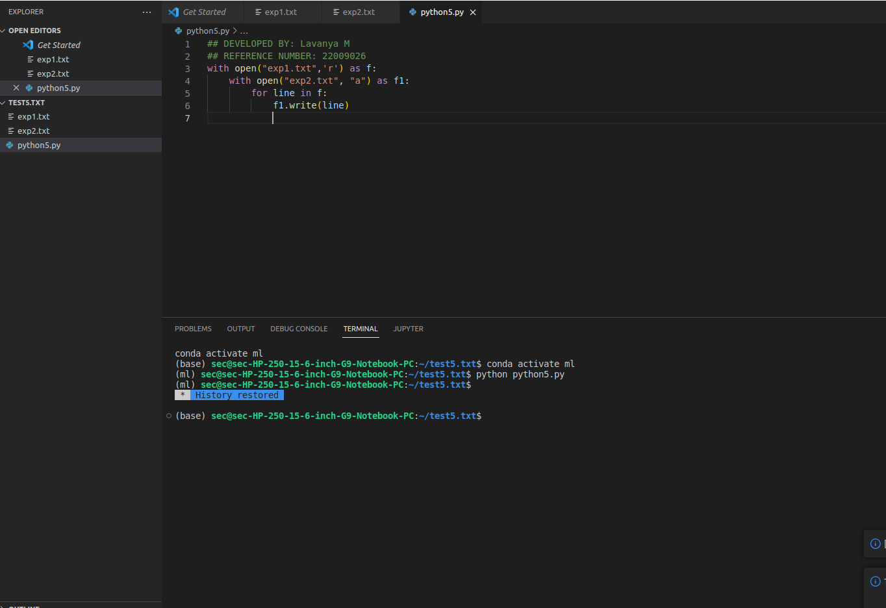
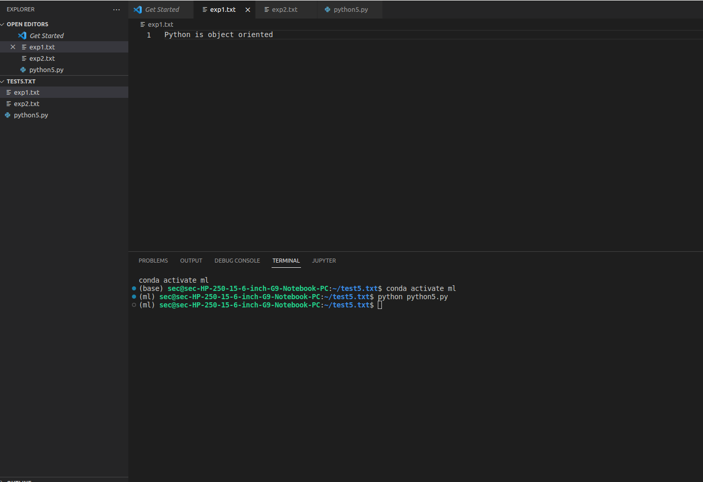

# copy-file
## AIM:
To write a python program for copying the contents from one file to another file.
## EQUIPEMENT'S REQUIRED: 
PC
Anaconda - Python 3.7
## ALGORITHM: 
### Step 1:
Open the first txt file and read it

### Step 2: 
 After that open the second file and append the first one to it
### Step 3: 
Start the for loop
### Step 4:  
Then write the lines from the first one to the second file using the write function
### Step 5: 
Print the output 

## PROGRAM:
```
#Developed by:Manoj S
#Register Number: 22009066

with open("exp1.txt") as f:
    with open("ext2.txt", "w") as f1:
        for line in f:
            f1.write(line)
```
OUTPUT:
### OUTPUT:




## RESULT:
Thus the program is written to copy the contents from one file to another file.